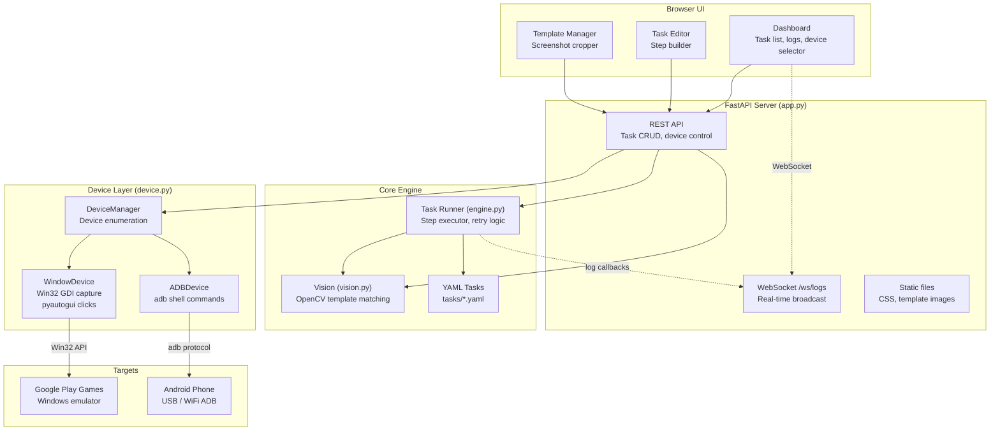
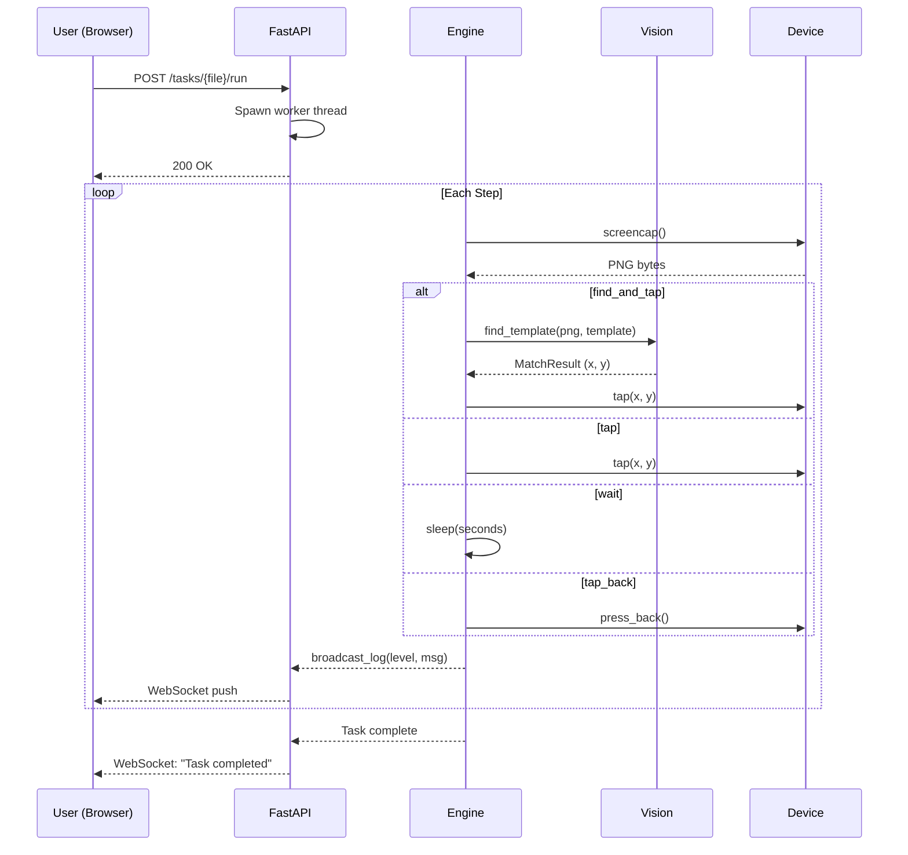
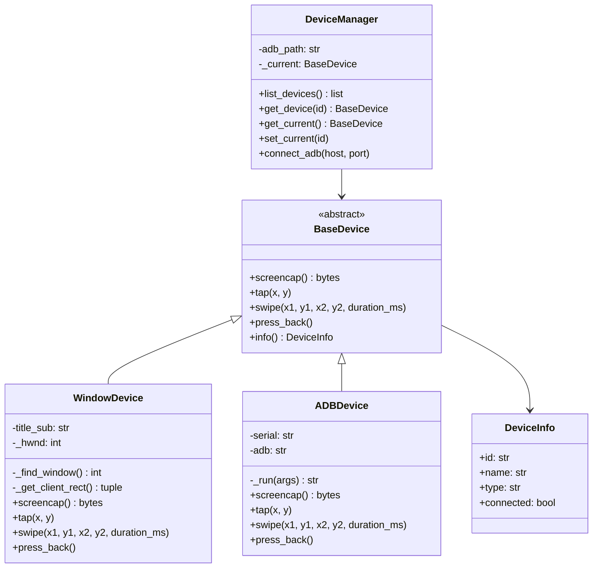
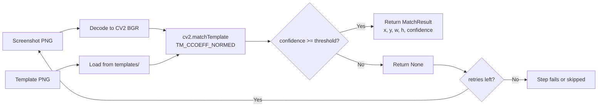

# WOS Bot Architecture

## System Overview



## Task Execution Flow



## Device Abstraction



## Template Matching Pipeline



## Data Storage

```
WOS/
├── tasks/              YAML task definitions (user-created)
│   ├── daily_rewards.yaml
│   ├── exploration.yaml
│   └── mail_reward.yaml
├── templates/          PNG images for template matching
│   ├── claim-all_button.png
│   ├── mail_button.png
│   └── tab-exit_button.png
└── screenshots/        Debug captures (auto-generated)
```

No database — all state is file-based. Task status lives in memory during server runtime.
